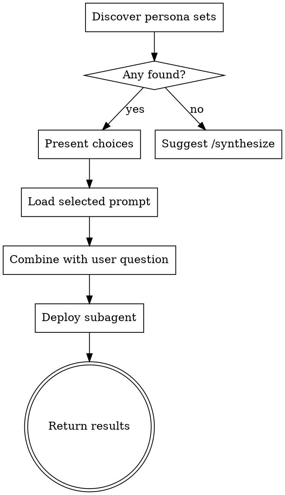

# Ask the Personas

Load a previously synthesized multi-persona prompt, combine it with the user's question, and deploy a subagent that performs the full adversarial multi-persona analysis.

## Invocation

```
/ask-the-personas "What approach should we take for migrating to microservices?"
```

The user's question is passed as the skill argument (`$ARGUMENTS`).

## Process Flow



## Step 1 — Discover Available Persona Sets

Search three locations for persona prompt files:

1. **Session-scoped** (tmp): glob `/tmp/persona-*.md`
2. **User-level agents**: glob `~/.claude/agents/persona-*.md`
3. **Project-level agents**: glob `.claude/agents/persona-*.md`

For each file found, read the YAML frontmatter to extract the `title` (or `name` for agent files) and `personas` list (or `description` for agent files).

If no persona sets are found, inform the user and suggest running `/synthesize-multi-persona-prompt` first. Stop here.

## Step 2 — Present Choices

Always present the full list of discovered persona sets to the user via AskUserQuestion. For each option, display:
- The prompt's **title/name** (e.g., "Cloud Migration Strategy Panel")
- **Source**: session / user-agent / project-agent
- **Persona roles**: the stakeholder names from the file

Let the user select which persona set to use.

## Step 3 — Load and Combine

Read the selected prompt file. Extract the multi-persona prompt body (everything after the YAML frontmatter).

Construct the subagent prompt by combining:
1. The multi-persona prompt (provides the personas, protocol, and format)
2. A clear instruction to analyze the user's specific question
3. The user's question from `$ARGUMENTS`

Structure the combined prompt so the subagent understands it must:
- Have each persona analyze the user's question independently
- Identify points of alignment and tension between personas
- Engage in constructive cross-persona dialogue
- Produce a synthesized recommendation

## Step 4 — Deploy Subagent

Dispatch a subagent using the Agent tool with:
- **description**: "Multi-persona analysis: <title>"
- **prompt**: the combined prompt from Step 3

The subagent executes the full multi-persona analysis and returns its output.

## Step 5 — Return Results

Present the subagent's analysis to the user. The output should follow the format specified in the multi-persona prompt (position statements, detailed analyses, cross-persona dialogue, synthesized recommendation).

No post-processing is needed — present the subagent's output directly.
