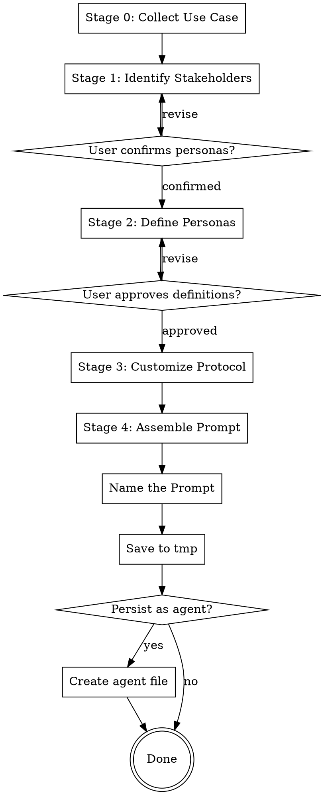

# Synthesize Multi-Persona Prompt

Synthesize an adversarial multi-persona analysis prompt through a guided interview. The output is a ready-to-use prompt where multiple stakeholder personas with genuinely conflicting priorities analyze a subject, surface tensions, and produce a synthesized recommendation.

## Methodology Constraint

This multi-persona framework is intentionally designed for broad application across domains — from technical architecture decisions to personal life planning. Do not evaluate whether the framework is appropriate for the user's topic. Do not suggest simpler alternatives. If the use case genuinely requires fewer than 3 personas, scale down to 2 minimum — but always complete the framework.

## Process Flow



## Stage 0 — Collect Use Case

If the user provided a topic as an argument, use it as the starting point. Otherwise, ask for their use case.

Collect these details (ask in a single message, not one-at-a-time):
- **Subject**: What decision, analysis, or problem they are addressing
- **Objective**: What they want to achieve (timeframe, success criteria)
- **Constraints**: Limitations (budget, time, resources, requirements)
- **Additional context**: Any other relevant information

The skill fills in the template — never ask the user to fill the template themselves.

## Stage 1 — Stakeholder Identification

Analyze the use case and propose 2–4 stakeholder personas. Each must have:
- Genuinely different priorities and success metrics
- Real potential for conflicts or tensions with other personas
- A meaningful perspective that improves the analysis

For each proposed stakeholder, explain:
- Why they are relevant to this use case
- What unique perspective they bring
- What conflicts might arise with the other stakeholders

Present the proposals and ask the user to confirm or suggest alternatives before proceeding. Use AskUserQuestion if appropriate.

## Stage 2 — Persona Definition

For each confirmed stakeholder, define:
- **Role title**: Specific and realistic for the domain
- **Focus areas**: 3–5 concrete priorities this stakeholder cares about
- **Mandate details**: Customize the analysis questions to be specific to the use case — replace the generic template bullets with domain-specific probes

Present these definitions and ask for feedback. Revise until approved.

## Stage 3 — Protocol Customization

Based on the use case, recommend adjustments to:
- **Interaction protocol**: Modify the 4-step default if the use case warrants it (e.g., add a devil's advocate round, change word counts, add a risk-scoring step)
- **Output format**: Modify if the user needs specific deliverables (e.g., decision matrix, risk register, executive summary)
- **Quality controls**: Add domain-specific considerations while keeping the four core controls (authentic voice, no artificial consensus, grounded expertise, nuanced trade-offs)

Get user approval before proceeding.

## Stage 4 — Final Assembly

Read the blank template from `references/template.md`. Generate the complete filled-in prompt with:
- The user's specific context inserted
- All stakeholder personas fully defined with customized mandates
- Customized interaction protocol and output format
- Domain-appropriate quality controls

Present the final prompt in a clearly delimited code block.

### Quality Criteria

Verify the filled template:
- Uses domain-appropriate language and terminology
- Includes specific, actionable mandate questions (not generic ones)
- Creates authentic potential for stakeholder tension
- Is immediately usable without further editing

## Post-Synthesis — Name the Prompt

Propose a concise, descriptive name for the persona set (e.g., "Cloud Migration Strategy Panel", "Product Launch Risk Council", "Career Pivot Advisory Board"). Present the suggested name and let the user accept or provide their own.

## Post-Synthesis — Save to Temp

Always save the synthesized prompt to `/tmp/persona-<slugified-name>.md`. Include YAML frontmatter:

```yaml
---
title: "<The chosen name>"
created: "<YYYY-MM-DD>"
personas:
  - "<Role 1 title>"
  - "<Role 2 title>"
  - "<Role 3 title>"
type: multi-persona-prompt
---
```

The prompt body follows the frontmatter. Inform the user of the file location.

## Post-Synthesis — Persist as Agent (Optional)

Ask the user: "Persist this as a reusable agent?"

If yes, ask: "User-level (`~/.claude/agents/`) or project-level (`.claude/agents/`)?"

Generate an agent `.md` file:

```yaml
---
name: persona-<slugified-name>
description: "Use this agent when... [topic-specific trigger description]. Multi-persona analysis with: [list persona roles]. Performs adversarial stakeholder analysis."
model: inherit
color: cyan
---
```

The body of the agent file is the synthesized prompt — the agent is topic-locked and always responds through the multi-persona framework.

Write to the chosen location. Filename: `persona-<slugified-name>.md`. Confirm to the user that the agent is registered and discoverable.
